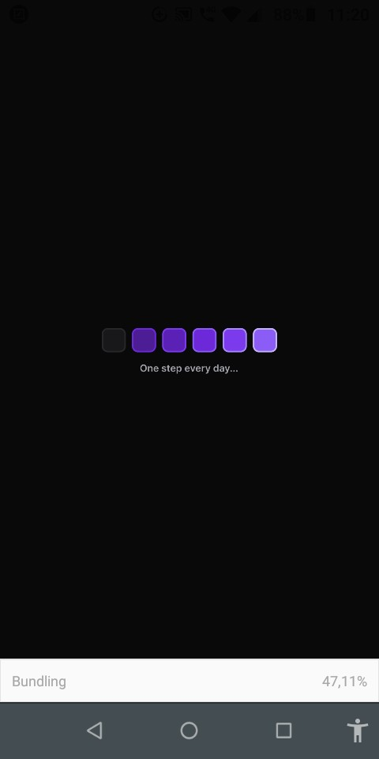
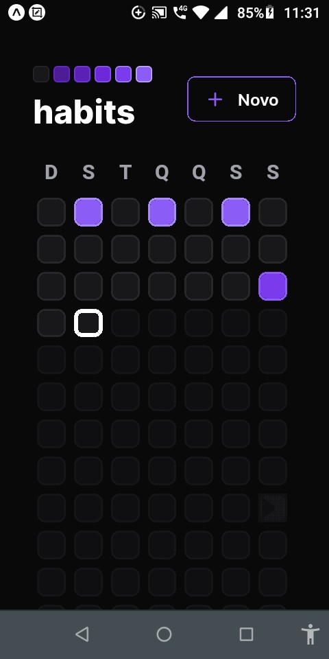
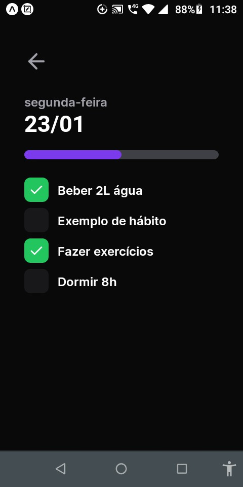
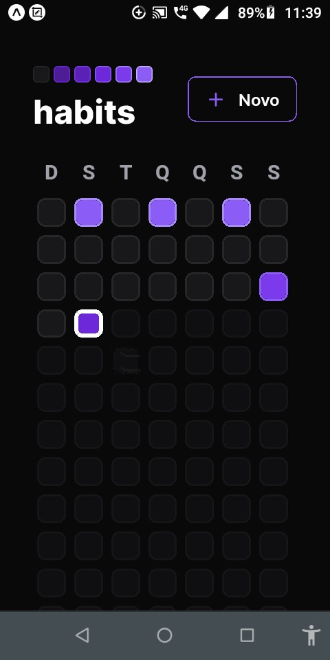

# Mobile
## Configurando o ambiente
## Criando o projeto mobile
```
  npx create-expo-app mobile --template
```

## Executando a aplicação
```
  npx expo start

  npx expo start --clear
```

## Instalando fontes personalizadas 
```
  npx expo install expo-font @expo-google-fonts/inter
```

Instalando o nativewind

npm i nativewind

npm i tailwindcss --save-dev

Criando tailwind.config.js

npx tailwindcss init

Acrescentar no babel.config.js

plugins: ["nativewind/babel"],

## Executando a aplicação
```
  npx expo start
```
## Para rodar o svg do logo
```
  npx expo install react-native-svg

  npm i react-native-svg-transformer --save-dev
```

## Intalar dayjs
Para manipulara datas
```
  npm install dayjs
```

## Intalando react navigation e sua dependências
```
  npm install @react-navigation/native

  npx expo install react-native-screens react-native-safe-area-context

  npm install @react-navigation/native-stack
```

## Intalando Axios
```
  npm i axios
```

## Instalando clsx
```
  npm install --save clsx
```

## Intalando reanimated do react native
```
  npx expo install react-native-reanimated
```

## Rodar usando clear
```
  npx expo start --clear
```

## Visual do projeto
<p>
  
  
  
  
  
  
</p>

## Links
https://docs.expo.dev

https://www.nativewind.dev/

https://reactnavigation.org/

https://www.reanimated2.com/
